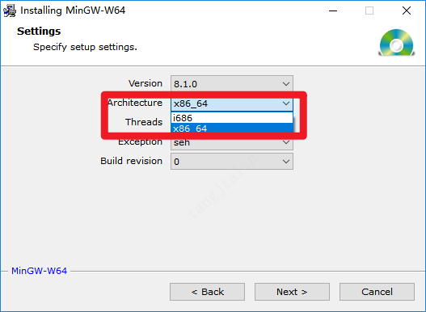

# jna-golang-sample

使用 Java 通过 jna 方式调用 Golang 语言的示例，并通过 InvocationMapper 和 TypeMapper 两种方式解决返回参数内存回收问题。

> 本项目因使用 cgo，故不支持交叉编译，虽然可通过 https://github.com/karalabe/xgo 的方式操作，但不如直接装目标虚拟机进行编译来的方便

## 环境搭建

### 1.安装 golang sdk

官方下载地址：https://golang.org/dl/

速度更快的下载地址：https://studygolang.com/dl

安装到任意你喜欢的地方，就已经完成了。

### 2.设置环境变量

- GOROOT

  > golang sdk 的安装目录

- GOPATH

  > go 代码存放的地方，但是 go1.11之后的版本不用将源码放在这里也可以了，所以此处是放置 go 所依赖的第三方源码的地方。

```bash
# 此路径仅为演示路径,实际路径请按你安装的 sdk 路径为准
GOROOT=D:\deve\go
# 此路径仅为演示路径,实际路径请按你喜欢的为准
GOPATH=D:\gopath
```


### 3.Go 模块代理

打开终端，并执行如下命令：

```bash
go env -w GOPROXY=https://goproxy.cn,direct
```


## 4.安装 gcc

### windows 安装方式

下载地址：http://sourceforge.net/projects/mingw-w64/files/Toolchains%20targetting%20Win32/Personal%20Builds/mingw-builds/installer/mingw-w64-install.exe/download

> 注意：安装的时候注意选平台。
>
> 

## 编译指令

### 通用编译

```bash
# 编译 windows 版本
go build -buildmode=c-shared -o awesome.dll awesome.go

# 编译 linux 版本
go build -buildmode=c-shared -o awesome.so awesome.go

# 编译 mac 版本
go build -buildmode=c-shared -o libawesome.dylib awesome.go
```

### 交叉编译

> 本项目因使用 cgo，故不支持交叉编译，虽然可通过 https://github.com/karalabe/xgo 的方式操作，但不如直接装目标虚拟机进行编译来的方便

**交叉编译**在 golang 中表示在某个平台下编译非本平台执行的二进制版本。

比如：在 windows 开发，需要编译出 linux 版本或 mac 版本。

可通过 `go env` 查看当前系统的变量：

```bash
> go env
set GOHOSTARCH=amd64 # 本机的架构
set GOHOSTOS=windows # 本机的系统
set GOARCH=amd64     # 目标平台的架构，交叉编译时需要设置
set GOOS=windows     # 目标平台的系统，交叉编译时需要设置
set CGO_ENABLED=0    # 是否启用 CGO
```

交叉编译的关键在于编译的时候需要指定两个变量：

- GOOS

  > 目标平台系统

- GOARCH

  > 目标平台架构

以上两个变量的值在后续有一份列表，可根据需要查阅。也可通过 golang sdk 自带命令 `go tool dist list` 查阅。

下面列出常用的 windows 、linux、mac 三个系统的编译指令。

#### 在 windows 上编译

```bash
# 编译 windows 版本
SET CGO_ENABLED=0
SET GOOS=windows
SET GOARCH=amd64
go build -buildmode=c-shared -o awesome.dll awesome.go

# 编译 linux 版本
SET CGO_ENABLED=0
SET GOOS=linux
SET GOARCH=amd64
go build -buildmode=c-shared -o awesome.so awesome.go

# 编译 mac 版本
SET CGO_ENABLED=0
SET GOOS=darwin
SET GOARCH=amd64
go build -buildmode=c-shared -o awesome.so awesome.go
```


#### 在 linux 上编译

```bash
# 编译 windows 版本
CGO_ENABLED=0 GOOS=windows GOARCH=amd64 go build -buildmode=c-shared -o awesome.dll awesome.go
# 编译 linux 版本
CGO_ENABLED=0 GOOS=linux GOARCH=amd64 go build -buildmode=c-shared -o awesome.so awesome.go
# 编译 mac 版本
CGO_ENABLED=0 GOOS=darwin GOARCH=amd64 go build -buildmode=c-shared -o awesome.so awesome.go
```


#### 在 mac 上编译

```bash
# 编译 windows 版本
CGO_ENABLED=0 GOOS=windows GOARCH=amd64 go build -buildmode=c-shared -o awesome.dll awesome.go
# 编译 linux 版本
CGO_ENABLED=0 GOOS=linux GOARCH=amd64 go build -buildmode=c-shared -o awesome.so awesome.go
# 编译 mac 版本
CGO_ENABLED=0 GOOS=darwin GOARCH=amd64 go build -buildmode=c-shared -o awesome.so awesome.go
```

### GOOS 和 GOARCH 支持列表

查看当前 Go 版本支持的编译平台

```bash
go tool dist list
```

